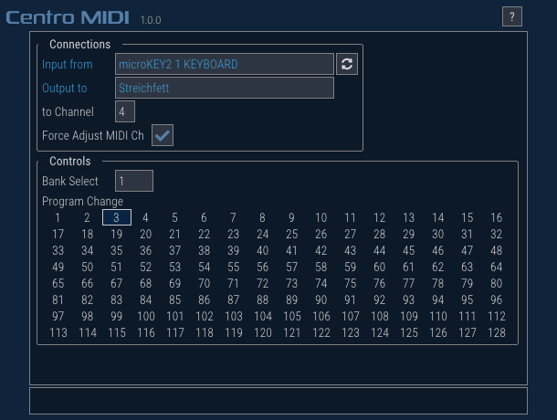

# Centro MIDI
MIDI single-path connection provider

## Features
- Connect single MIDI input/output combination
- Receive MIDI note message from the MIDI input device
- Send MIDI note/bank-select/program-change message to the MIDI output device

## Dependencies (Latest version)
- [SDL 2.0.10](https://github.com/libsdl-org/SDL/tree/release-2.0.10)
- [imgui 1.87 w/ dock](https://github.com/ocornut/imgui/tree/1ee252772ae9c0a971d06257bb5c89f628fa696a)
- [plog 1.1.10](https://github.com/SergiusTheBest/plog/tree/1.1.10)
- [RtMidi 4.0.0](https://github.com/thestk/rtmidi/tree/4.0.0)

## Changelog

### v1.0.0
- Initial release
